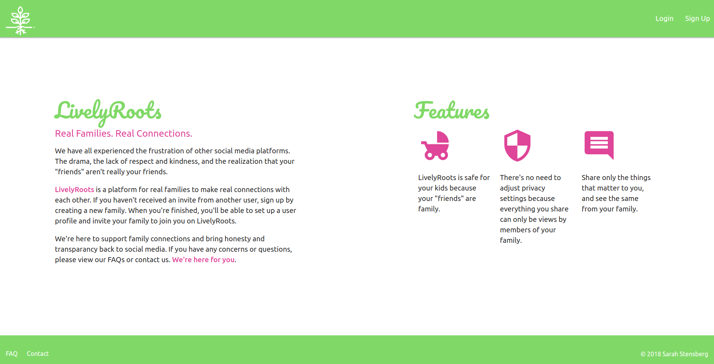

# LivelyRoots
LivelyRoots is a social-media app built for families.

### Getting Started

[Trello Board](https://trello.com/b/G84u9FsW/livelyroots)
[Heroku Deploy](https://guarded-brook-19815.herokuapp.com/) 

### Built With
* Python
* Django
* CSS
* HTML

### License:

This project is licensed under the [MIT License](https://opensource.org/licenses/MIT), &copy; 2018 Sarah Stensberg.

### Acknowledgments:

Tree Icon by [Freepik](http://www.freepik.com) on [Flaticon](http://www.flaticon.com) 

### Next Steps:

* Allow users to send invites to family members from the app, with the family code embedded in the e-mail message
* Allow users to add tags to posts
* Allow users to upload a profile photo
* Allow users to add photos and video to posts